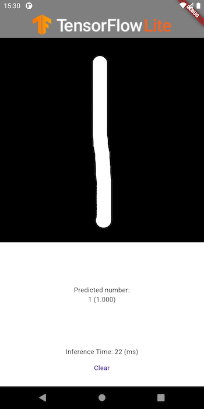
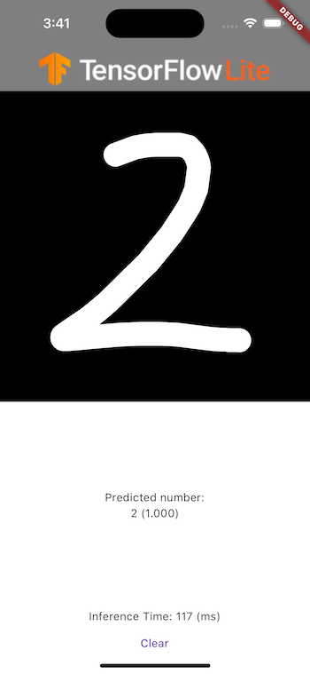

# Digit classification

An end-to-end sample of a digit classification using Tensorflow
Lite in Flutter. It includes support for both Android and IOS.

## Download model

To build the project, you must first download the Mnist TensorFlow Lite
model. You can do this by running sh
./scripts/download_model.sh from the root folder of the repository.

## About the sample

- You can use Flutter-supported IDEs such as Android Studio or Visual Studio.
  This project has been tested on Android Studio Flamingo.
- Before building, ensure that you have downloaded the model by
  following a set of instructions.

### Screenshot
#### Android

#### IOS

