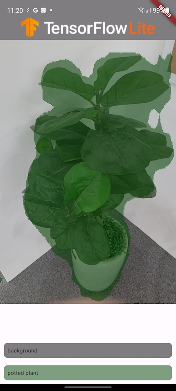
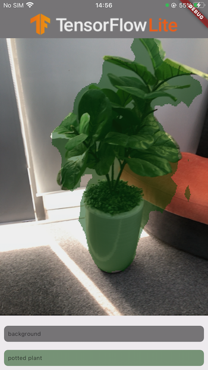

# Image Segmentation DeeplabV3

|      | Android | iOS | Linux | Mac | Windows | Web |
|------|---------|-----|-------|-----|---------|-----|
| live | ✅       | ✅   |       |    |         |     |

This project is a sample of how to perform Image Segmentation using
TensorFlow Lite in Flutter. It includes support for both Android and IOS.

## Download model and labels

To build the project, you must first download the Deeplab V3 TensorFlow Lite
model and its corresponding labels. You can do this by
running `sh ./scripts/download_model.sh` from the root folder of the repository.

## About the sample

- You can use Flutter-supported IDEs such as Android Studio or Visual Studio.
  This project has been tested on Android Studio Flamingo.
- Before building, ensure that you have downloaded the model and the labels by
  following a set of instructions.

## Screenshots
### Android

### IOS

