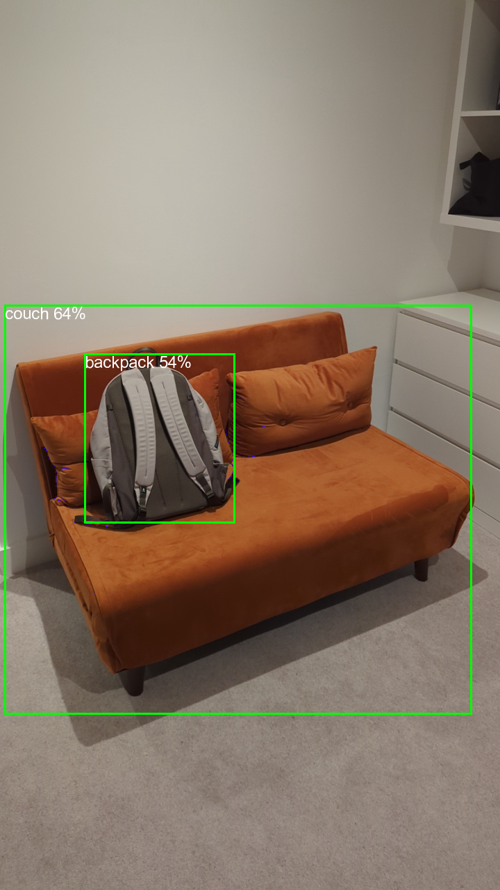

# Object Detection

Live object detection example following [this](https://www.tensorflow.org/lite/examples/object_detection/overview) example.

## Overview

This application is a simple demonstration of the [tflite_flutter](https://pub.dev/packages/tflite_flutter) package.

Object detection applies on an image stream from camera.
All expensive and heavy operations are performed in a separate isolate.

## How to start

Run 'sh ./scripts/download_model.sh' from your repo core folder to download tf models.

