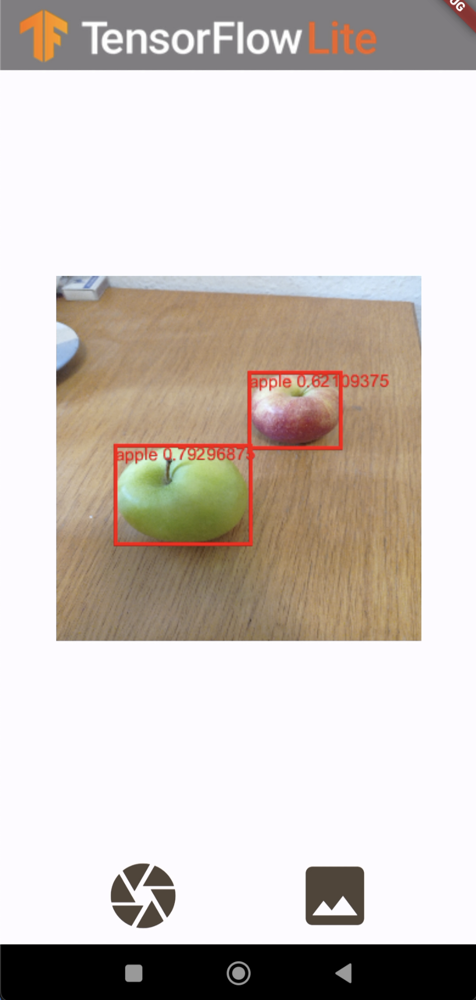

# Object Detection

A object detection example following [this](https://www.tensorflow.org/lite/examples/object_detection/overview) example.

## Overview

This application is a simple demonstration of the [tflite_flutter](https://pub.dev/packages/tflite_flutter) package.

After taking a photo or choosing an image from your gallery, the app takes a short period of time before displaying the image with the detected objects on the screen.

