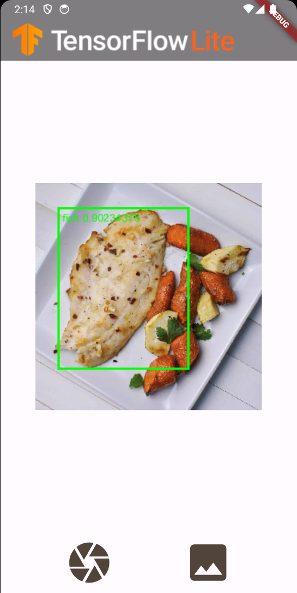

# Object Detection

|      | Android | iOS | Linux | Mac | Windows | Web |
|------|---------|-----|-------|-----|---------|-----|
| file | ✅       | ✅   | ✅   | ✅   |   ✅     |     |
| life | ✅       | ✅   |   [🚧](https://github.com/flutter/flutter/issues/41710)    | [🚧](https://github.com/flutter/flutter/issues/41708)   |   [🚧](https://github.com/flutter/flutter/issues/41709)     |     |

A object detection example following [this](https://www.tensorflow.org/lite/examples/object_detection/overview) example.

## Overview

This application is a simple demonstration of the [tflite_flutter](https://pub.dev/packages/tflite_flutter) package.

After taking a photo or choosing an image from your gallery, the app takes a short period of time before displaying the image with the detected objects on the screen.

## Changes from SSD MobileNet V1:

Fixed [#134](https://github.com/tensorflow/flutter-tflite/issues/134): Since the output's order of SSD MobileNet V1 is different, output's tensors must be rearraged to get the correct output of V2 . Adjusments within the codes need to be changed according to the output shape and tensors as well. 

This example will work with both SSD MobileNet V2 and SSD MobileNet V2 FPN Lite 320 x 320 (See the comments in code for proper model switch)

