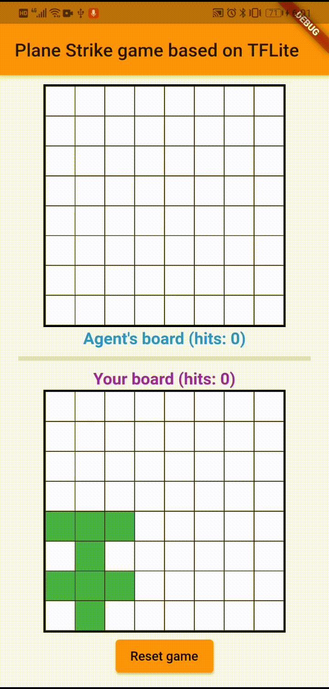

# Reinforcement Learning Example 

Refer to [this blog](https://blog.tensorflow.org/2021/10/building-board-game-app-with-tensorflow.html) for background.

### Overview

This app demonstrate a reinforcement learning agent for a simple board game. It is ported from the [official Android app](https://www.tensorflow.org/lite/examples/reinforcement_learning/overview).

### Instructions

Run `scripts/download.sh` first to download the model and then start the Flutter app.

